<p align="center">
  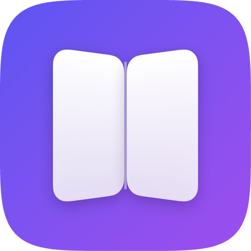
</p>

<h1 align="center">iPhone Duo by Examples</h1>

<p align="center">
  The SwiftUI APIs for the foldable <b>iPhone Duo</b>, one runnable example at a time.
</p>

<p align="center">
  
  
  
  
  <a href="LICENSE"></a>
</p>

<p align="center">
  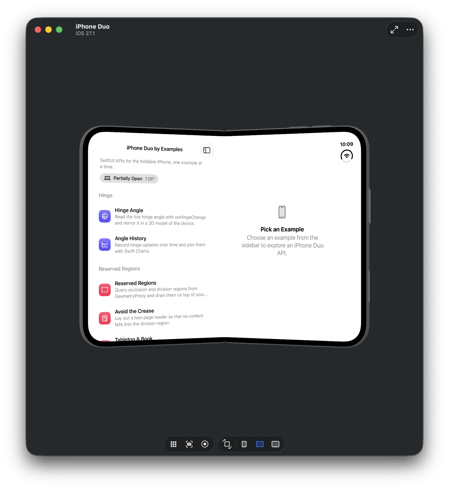
</p>

iOS 27.1 adds a set of SwiftUI APIs for the iPhone Duo: reading the hinge, finding the fold and the camera, arranging views side by side, and controlling the new vertical bar. This project demonstrates each of them in a small example that you can run, read, and copy.

- Each example lives in **one file** in [`iPhoneDuoByExamples/Examples`](iPhoneDuoByExamples/Examples).
- Each file begins with a doc comment that explains the API.
- `// 👇 The API:` comments mark the lines that matter.

## Contents

- [Getting Started](#getting-started)
- [Examples](#examples)
- [API Cheat Sheet](#api-cheat-sheet)
- [Good to Know](#good-to-know)
- [Project Structure](#project-structure)
- [See Also](#see-also)
- [Resources](#resources)
- [Contributing](#contributing)
- [Author](#author)
- [License](#license)

## Getting Started

**Requirements:** Xcode 27.1 or later, and the iPhone Duo simulator (iOS 27.1) or an iPhone Duo.

```bash
git clone https://github.com/artemnovichkov/iPhone-Duo-by-Examples.git
cd iPhone-Duo-by-Examples
open iPhoneDuoByExamples.xcodeproj
```

Select the **iPhone Duo** run destination and press <kbd>⌘</kbd><kbd>R</kbd>. Fold and unfold the device in Simulator to watch the examples react.

> [!TIP]
> To open an example directly, pass its name as a launch argument. For example, `-example hingeAngle` or `-example avoidDivision`. The names are the cases of the [`Example`](iPhoneDuoByExamples/Catalog/Example.swift) enum.

## Examples

### Hinge

<table>
<tr>
<td width="50%" valign="top">
<p><a href="iPhoneDuoByExamples/Examples/HingeAngleExample.swift">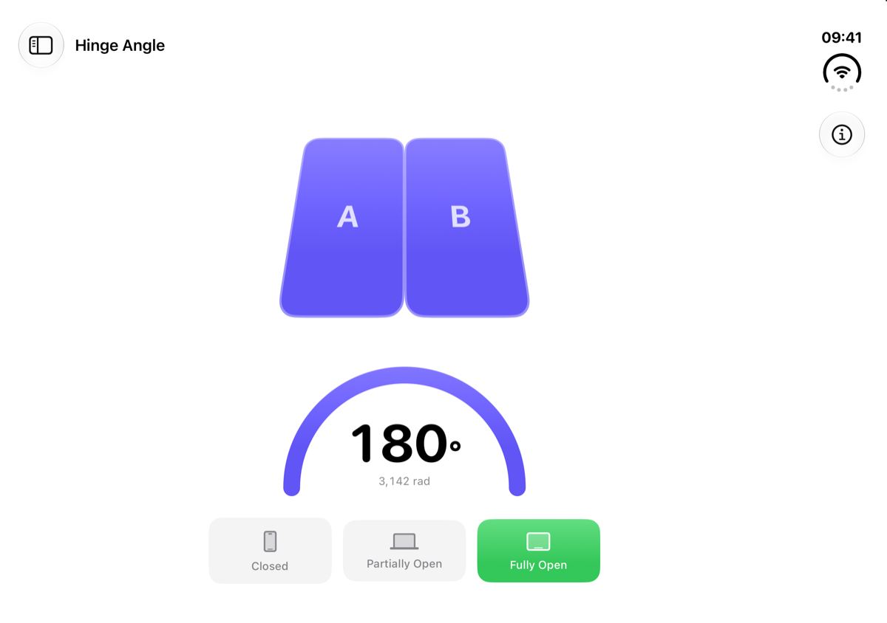</a></p>
<p><a href="iPhoneDuoByExamples/Examples/HingeAngleExample.swift"><b>Hinge Angle</b></a></p>
<p>Reads the live angle with <code>onHingeChange</code> and mirrors it in a 3D model of the device, a gauge, and a status strip.</p>
</td>
<td width="50%" valign="top">
<p><a href="iPhoneDuoByExamples/Examples/HingeHistoryExample.swift">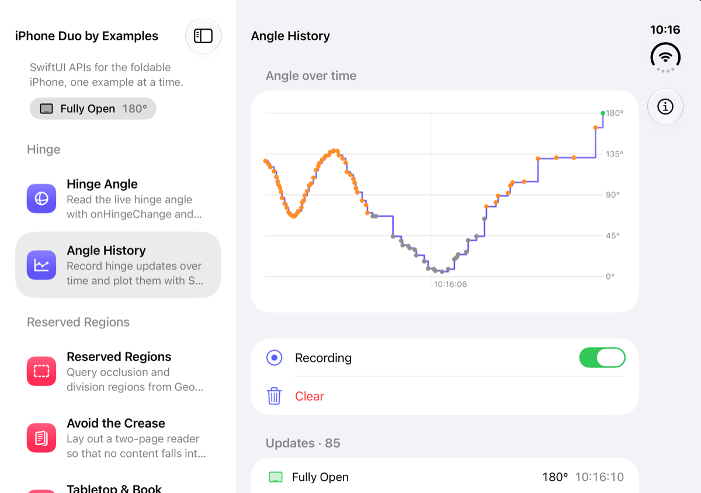</a></p>
<p><a href="iPhoneDuoByExamples/Examples/HingeHistoryExample.swift"><b>Angle History</b></a></p>
<p>Records every hinge update and plots it with Swift Charts. Uses <code>isEnabled</code> to pause delivery.</p>
</td>
</tr>
</table>

### Reserved Regions

<table>
<tr>
<td width="50%" valign="top">
<p><a href="iPhoneDuoByExamples/Examples/ReservedRegionsExample.swift">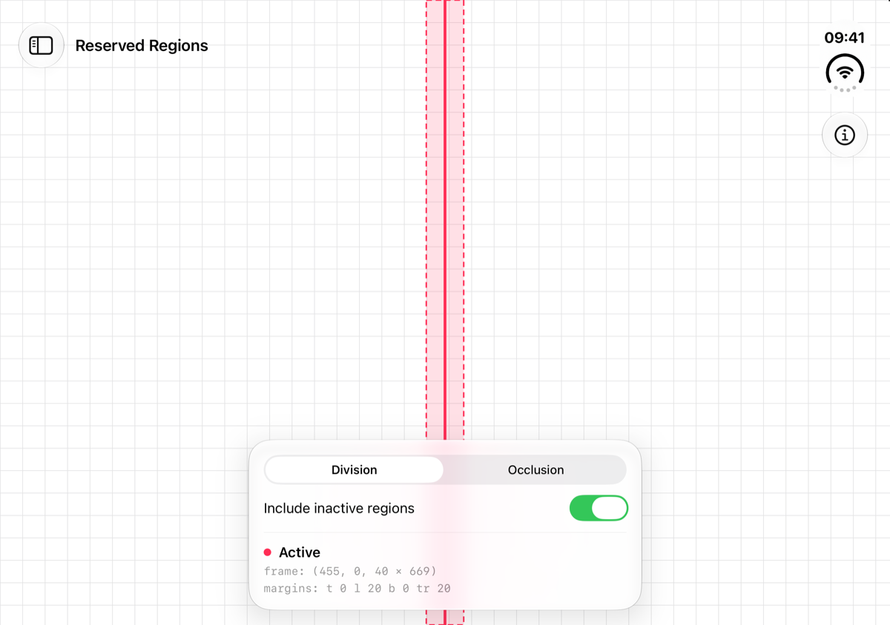</a></p>
<p><a href="iPhoneDuoByExamples/Examples/ReservedRegionsExample.swift"><b>Reserved Regions</b></a></p>
<p>Queries <code>.division</code> and <code>.occlusion</code> regions from <code>GeometryProxy</code> and draws each region's frame, margins, and active state.</p>
</td>
<td width="50%" valign="top">
<p><a href="iPhoneDuoByExamples/Examples/AvoidDivisionExample.swift">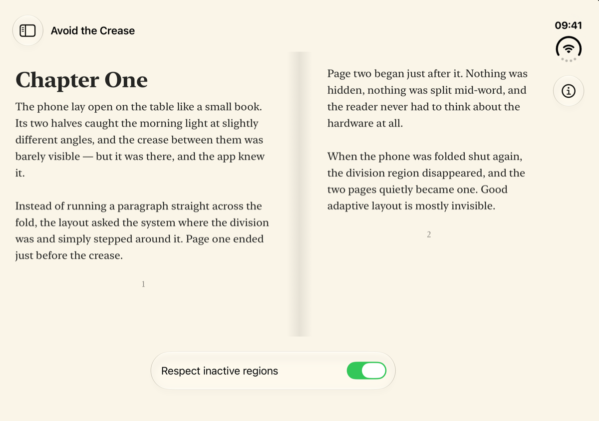</a></p>
<p><a href="iPhoneDuoByExamples/Examples/AvoidDivisionExample.swift"><b>Avoid the Crease</b></a></p>
<p>A two-page reader that places one page on each side of the division region. When there's no division, it falls back to one page.</p>
</td>
</tr>
<tr>
<td width="50%" valign="top">
<p><a href="iPhoneDuoByExamples/Examples/TabletopExample.swift">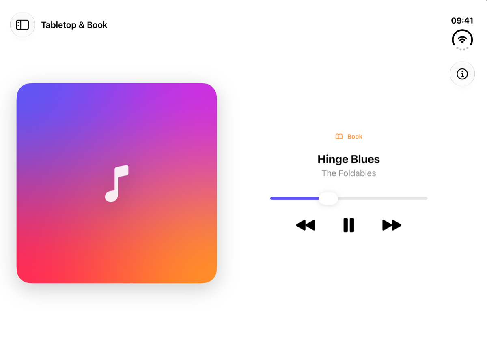</a></p>
<p><a href="iPhoneDuoByExamples/Examples/TabletopExample.swift"><b>Tabletop &amp; Book</b></a></p>
<p>Lays out a media player around the <i>active</i> division region: artwork above and controls below in tabletop pose, side by side in book pose. Apple recommends reserved regions, not the hinge angle, for layout.</p>
</td>
<td width="50%" valign="top">
<p><a href="iPhoneDuoByExamples/Examples/EvenColumnsExample.swift">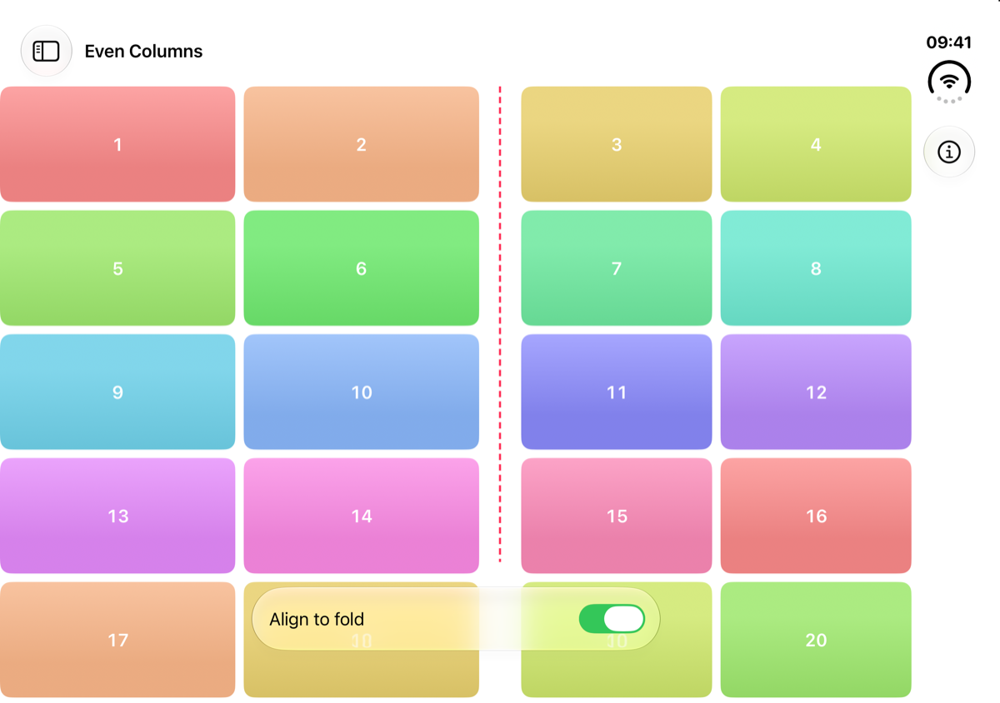</a></p>
<p><a href="iPhoneDuoByExamples/Examples/EvenColumnsExample.swift"><b>Even Columns</b></a></p>
<p>Uses the <i>inactive</i> division region to give a grid an even number of columns, with a gutter right over the fold.</p>
</td>
</tr>
</table>

### Arrangements

<table>
<tr>
<td width="50%" valign="top">
<p><a href="iPhoneDuoByExamples/Examples/SplitArrangementExample.swift">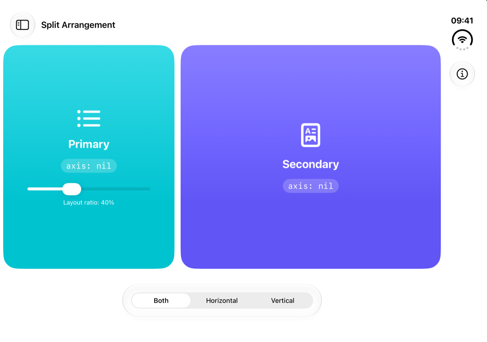 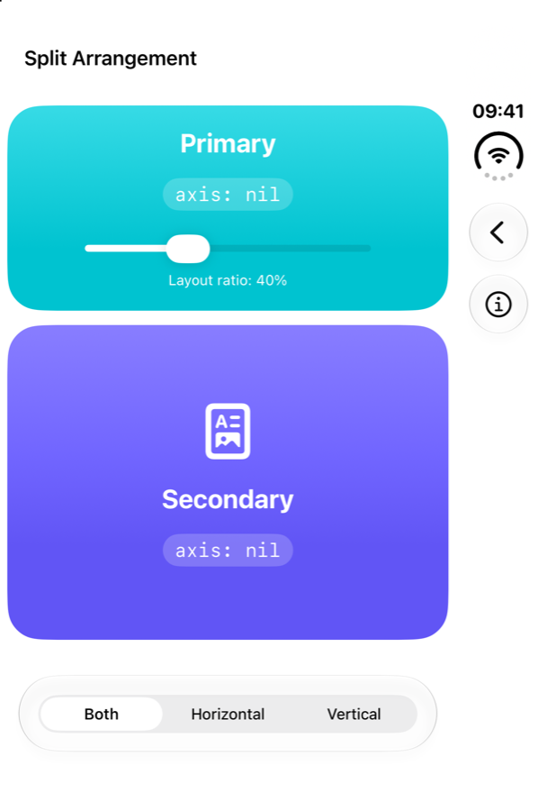</a></p>
<p><a href="iPhoneDuoByExamples/Examples/SplitArrangementExample.swift"><b>Split Arrangement</b></a></p>
<p><code>ArrangementView</code> with the <code>.split</code> style. Sets the allowed axes and the pane ratio with <code>splitArrangementLayoutRatio</code>. When unfolded, the panes sit side by side; when folded, they stack.</p>
</td>
<td width="50%" valign="top">
<p><a href="iPhoneDuoByExamples/Examples/OverlayArrangementExample.swift">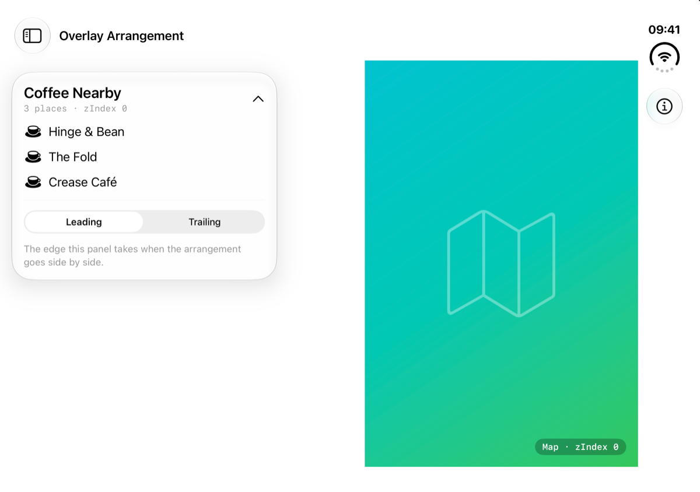</a></p>
<p><a href="iPhoneDuoByExamples/Examples/OverlayArrangementExample.swift"><b>Overlay Arrangement</b></a></p>
<p><code>ArrangementView</code> with the <code>.overlay</code> style: a results panel over a map. The panel collapses while <code>overlayArrangementZIndex</code> says it covers the map, and expands when the partially folded device puts the two side by side. <code>overlayArrangementEdge</code> sets which side the panel takes.</p>
</td>
</tr>
</table>

### Bars & Margins

<table>
<tr>
<td width="50%" valign="top">
<p><a href="iPhoneDuoByExamples/Examples/VerticalToolbarExample.swift">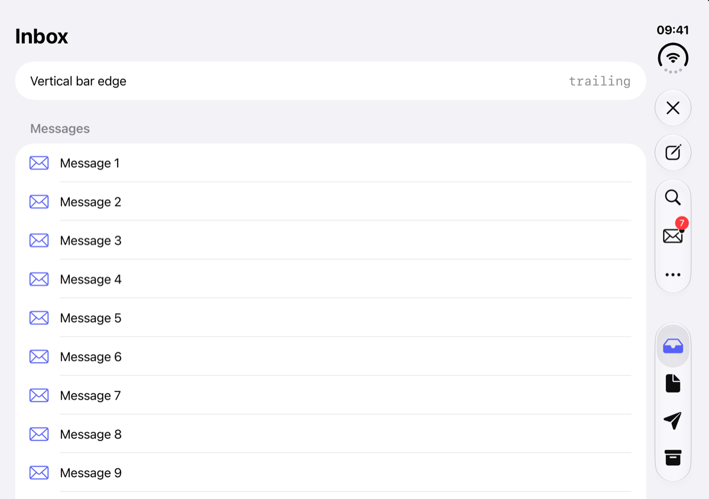</a></p>
<p><a href="iPhoneDuoByExamples/Examples/VerticalToolbarExample.swift"><b>Vertical Toolbar</b></a></p>
<p>A mail-style demo with a tab bar and toolbar items in the vertical bar. Covers <code>toolbarVerticalBehavior</code>, <code>toolbarVerticalCompressionBehavior</code>, <code>axisBehavior</code>, <code>visibilityPriority</code>, <code>.topBarPinnedTrailing</code>, <code>ToolbarOverflowMenu</code>, badges, and <code>toolbarVerticalEdge</code>.</p>
</td>
<td width="50%" valign="top">
<p><a href="iPhoneDuoByExamples/Examples/ContainerMarginsExample.swift">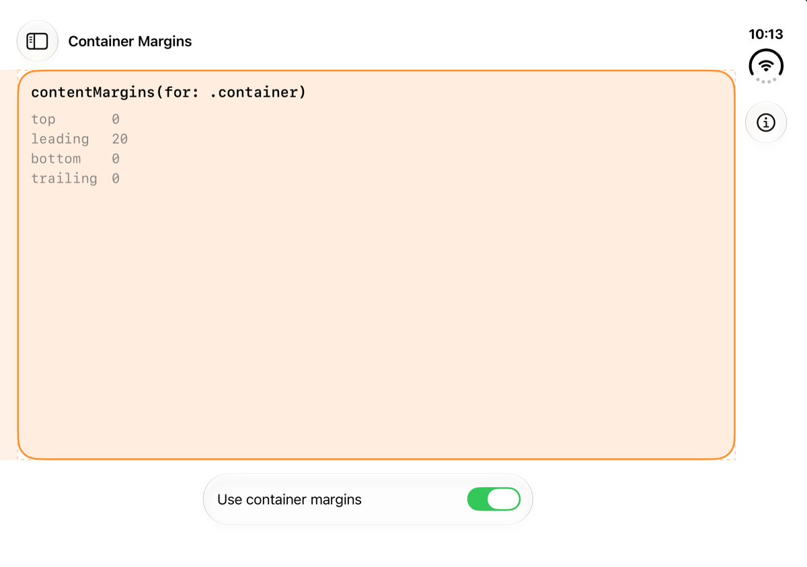</a></p>
<p><a href="iPhoneDuoByExamples/Examples/ContainerMarginsExample.swift"><b>Container Margins</b></a></p>
<p><code>contentMargins(for: .container)</code> compared with a hard-coded padding, and the raw values from <code>GeometryProxy.contentMargins(for:)</code>.</p>
</td>
</tr>
</table>

### Adaptivity

<table>
<tr>
<td width="50%" valign="top">
<p><a href="iPhoneDuoByExamples/Examples/FoldedUnfoldedExample.swift">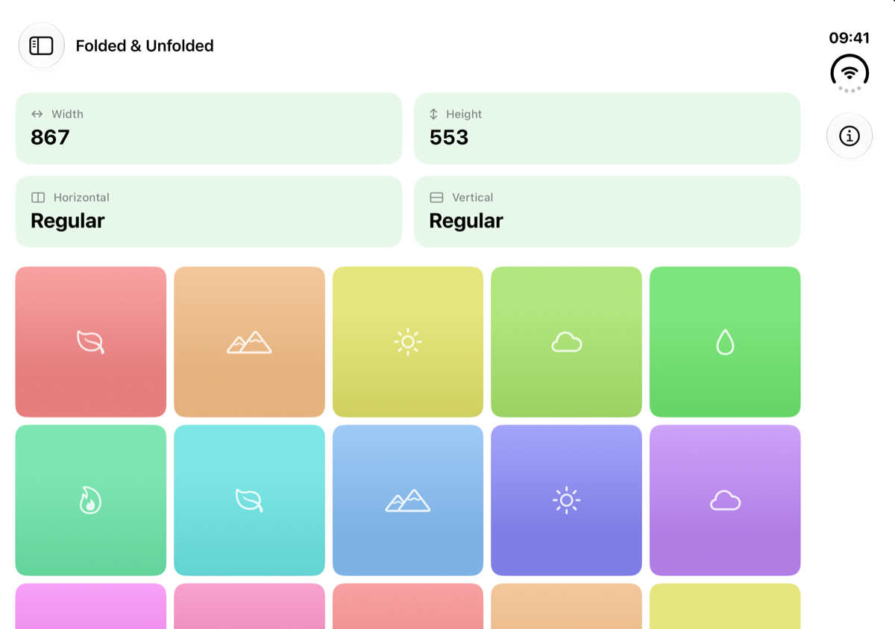 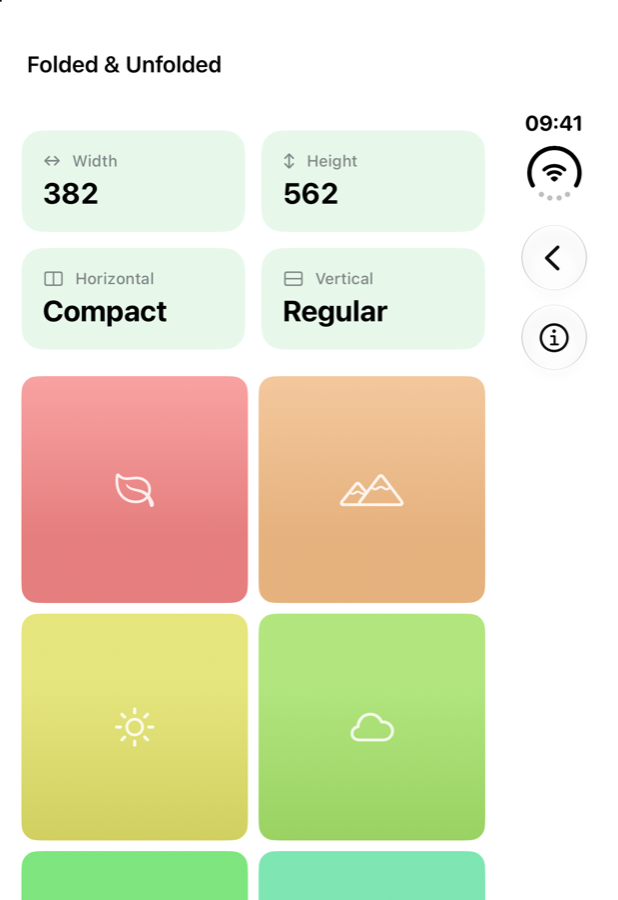</a></p>
<p><a href="iPhoneDuoByExamples/Examples/FoldedUnfoldedExample.swift"><b>Folded &amp; Unfolded</b></a></p>
<p>Adapts a layout to the space the app has, using size classes and <code>onGeometryChange</code>, rather than checking which device it runs on.</p>
</td>
</tr>
</table>

## API Cheat Sheet

### Hinge

```swift
@State private var hinge: DeviceHinge?

var body: some View {
    content
        .onHingeChange { oldContext, newContext in
            // `hinge` is nil when the view isn't in a hierarchy that provides hinge updates.
            hinge = newContext.hinge
        }
}

// hinge.angle   -> Angle (180° when the device is flat)
// hinge.status  -> .closed, .partiallyOpen, .fullyOpen
```

> [!IMPORTANT]
> Use the hinge for interactions and effects. For layout, use reserved regions and arrangements.

`onHingeChange(isEnabled:_:)` runs its action with the initial state and again on every change. To pause updates without removing the modifier, pass `isEnabled: false`.

### Reserved regions

```swift
GeometryReader { proxy in
    let folds = proxy.reservedRegions(kind: .division)
    let cutouts = proxy.reservedRegions(kind: .occlusion, options: [.includeInactive])

    ForEach(folds) { region in
        // region.frame     — in the proxy's coordinate space, margins included
        // region.margins   — room to keep clear around the reserved rect
        // region.isActive  — whether it currently affects your layout
    }
}
```

The division region is active only while the device is partially folded. Lay out around active regions. Use inactive ones for high-level decisions, such as an even number of grid columns.

### Arrangements

```swift
ArrangementView {
    Sidebar()
        .splitArrangementLayoutRatio(0.4)
} secondary: {
    Detail()
}
.arrangementViewStyle(.split.axes([.horizontal, .vertical]))
```

```swift
ArrangementView {
    FloatingPanel()                          // floats on top
        .overlayArrangementEdge(.leading)    // its edge when the layout goes side by side
} secondary: {
    Map()                                    // fills the container
}
.arrangementViewStyle(.overlay)

struct PanelContent: View {                  // a subview of FloatingPanel
    @Environment(\.overlayArrangementZIndex) private var zIndex
    // zIndex > 0 -> floating over the map: collapse
}
```

Other modifiers: `splitArrangementLayoutRatio(minHorizontal:idealHorizontal:…)`, `splitArrangementLayoutSize(minWidth:…)`, and `splitArrangementFixedLayoutSize(horizontal:vertical:)`. To write your own style, conform to the `ArrangementViewStyle` protocol.

### Vertical bar

```swift
TabView { … }
    .toolbarVerticalBehavior(.disabled)                     // opt out, e.g. for a video player

NavigationStack { … }
    .toolbar {
        ToolbarItem(placement: .topBarPinnedTrailing) { … }  // never overflows
        ToolbarItem(placement: .primaryAction) { … }
            .axisBehavior(.verticalPreferred)               // or .horizontalOnly
            .visibilityPriority(.high)
        ToolbarOverflowMenu { … }                           // straight into the overflow menu
    }
    .toolbarVerticalCompressionBehavior(.prefersTabBar)     // or .prefersToolbarItems

@Environment(\.toolbarVerticalEdge) private var edge        // .leading, .trailing, or nil
```

### Container margins

```swift
content
    .contentMargins(for: .container)

GeometryReader { proxy in
    let margins = proxy.contentMargins(for: .container)
}
```

## Good to Know

These are observations from the iPhone Duo simulator on iOS 27.1. They aren't documented guarantees.

- **The division region is active only when the device is partially folded.** When flat, it's inactive. Its frame is the same in both states: 40 pt wide, with 20 pt margins on each side of a zero-width fold line.
- **Reserved regions arrive after the first layout pass.** Read them in the `GeometryReader` body so the view updates when they arrive. Don't cache them.
- **Most regions are inactive by default.** On a fully open device, the fold is reported as an *inactive* division region, and the camera is an inactive occlusion region. To see them, pass `.includeInactive`.
- **The status bar area of the vertical bar is an active occlusion region.**
- **When folded, the outer display has no reserved regions at all**, not even inactive ones. The outer display is compact width and regular height, and it also has a vertical bar on the trailing edge.
- **In the `.overlay` style, the _primary_ view floats** in the top leading corner, and the _secondary_ view fills the space behind it. When the device is partially folded, the two go side by side.
- **Read `overlayArrangementZIndex` from a subview** of the primary or secondary content. The root view of the content always reads `0`.
- **Arrangements follow the fold.** In book pose, `.split` places its divider on the fold, even if that overrides `splitArrangementLayoutRatio`.
- **In the `.split` style, the secondary view can disappear.** If both views don't fit along an allowed axis, only the primary view is shown. For example, this happens with `.split.axes(.vertical)` on a wide screen.
- **`splitArrangementAxis` was `nil`** in every configuration tested in the simulator.
- **Don't depend on the timing of hinge angle updates.** Their rate and precision are system policy. If you only need the posture, use `status`.
- **The vertical bar configuration flows up** to the window or the nearest presentation. That's why the Vertical Toolbar demo is presented full screen.

## Project Structure

```
iPhoneDuoByExamples
├── App           # App entry point
├── Catalog       # Example list, info sheet, metadata
├── Components    # Shared views and DeviceHinge helpers
├── Examples      # One file per example ← start here
└── Resources     # Asset catalog
```

The Xcode project uses Xcode's JSON project format ([`project.xcproj`](iPhoneDuoByExamples.xcodeproj/project.xcproj)). It's readable and easy to edit by hand; each source file is listed there with its target membership.

## See Also

- [Accorduon](https://github.com/artemnovichkov/Accorduon): an accordion for iPhone Duo where the hinge is the bellows. Fold and unfold to play. A full app built on `onHingeChange`.
- [Duogami](https://github.com/artemnovichkov/Duogami): an origami workshop for iPhone Duo. Fold the phone to fold the paper. A full app built on `onHingeChange` and `reservedRegions`.

## Resources

- [Get Ready for iPhone Duo](https://developer.apple.com/iphone-duo/)
- [Preparing your app for iPhone Duo](https://developer.apple.com/documentation/technologyoverviews/preparing-your-app-for-iphone-duo)
- [Designing for iPhone Duo](https://developer.apple.com/design/human-interface-guidelines/designing-for-iphone-duo) in the Human Interface Guidelines
- Tech Talks:
  - [Prepare your app for iPhone Duo](https://developer.apple.com/videos/play/tech-talks/111461/)
  - [Raise the bar with iPhone Duo](https://developer.apple.com/videos/play/tech-talks/111462/)
  - [Strike a pose with adaptive layouts on iPhone Duo](https://developer.apple.com/videos/play/tech-talks/111463/)
  - [Leverage multiple displays and scenes on iPhone Duo](https://developer.apple.com/videos/play/tech-talks/111464/)
  - [Design for iPhone Duo](https://developer.apple.com/videos/play/tech-talks/111466/)

## Contributing

Found a new API, or a better way to use one? Issues and pull requests are welcome. Please keep each example in a single file and focused on one idea.

## Author

Artem Novichkov, https://artemnovichkov.com/

## License

The project is available under the MIT license. See the [LICENSE](./LICENSE) file for more info.
