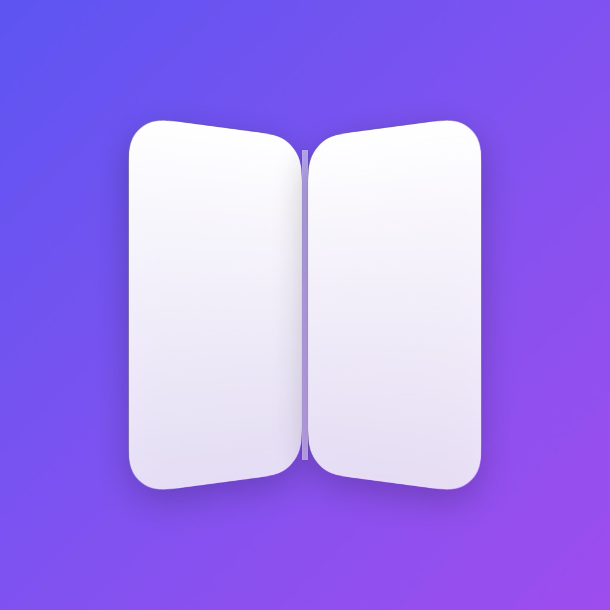
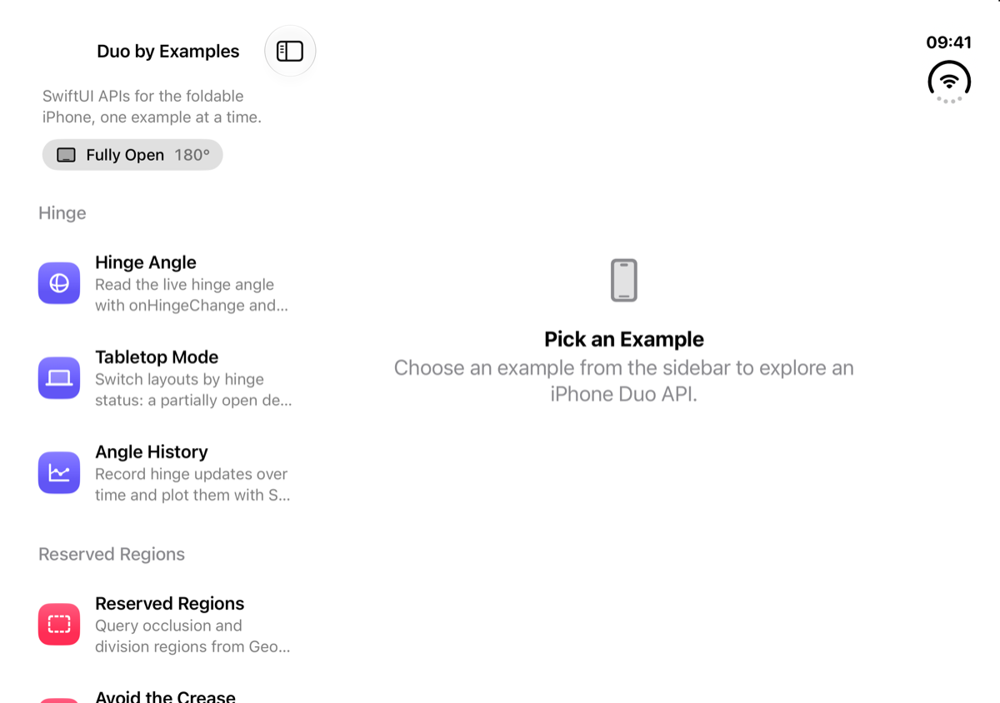
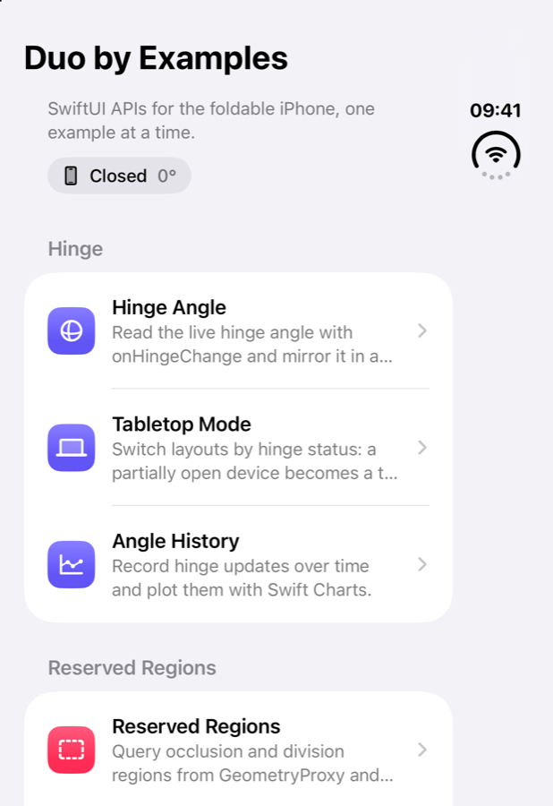

<p align="center">
  
</p>

<h1 align="center">Duo by Examples</h1>

<p align="center">
  The SwiftUI APIs for the foldable <b>iPhone Duo</b>, one runnable example at a time.
</p>

<p align="center">
  
  
  
  
  <a href="LICENSE"></a>
</p>

<p align="center">
  
  &nbsp;
  
</p>

iOS 27.1 adds a set of SwiftUI APIs for the iPhone Duo: reading the hinge, finding the fold and the camera, arranging views side by side, and controlling the new vertical bar. This project demonstrates each of them in a small example that you can run, read, and copy.

- Each example lives in **one file** in [`DuoByExamples/Examples`](DuoByExamples/Examples).
- Each file begins with a doc comment that explains the API.
- `// 👇 The API:` comments mark the lines that matter.

## Contents

- [Getting Started](#getting-started)
- [Examples](#examples)
- [API Cheat Sheet](#api-cheat-sheet)
- [Good to Know](#good-to-know)
- [Project Structure](#project-structure)

## Getting Started

**Requirements:** Xcode 27.1 or later, and the iPhone Duo simulator (iOS 27.1) or an iPhone Duo.

```bash
git clone https://github.com/artemnovichkov/DuoByExamples.git
cd DuoByExamples
open DuoByExamples.xcodeproj
```

Select the **iPhone Duo** run destination and press <kbd>⌘</kbd><kbd>R</kbd>. Fold and unfold the device in Simulator to watch the examples react.

> [!TIP]
> To open an example directly, pass its name as a launch argument. For example, `-example hingeAngle` or `-example avoidDivision`. The names are the cases of the [`Example`](DuoByExamples/Catalog/Example.swift) enum.

## Examples

### Hinge

| | Example | What it shows |
|---|---|---|
|  | [**Hinge Angle**](DuoByExamples/Examples/HingeAngleExample.swift) | Reads the live angle with `onHingeChange` and mirrors it in a 3D model of the device, a gauge, and a status strip. |
| | [**Angle History**](DuoByExamples/Examples/HingeHistoryExample.swift) | Records every hinge update and plots it with Swift Charts. Uses `isEnabled` to pause delivery. |

### Reserved Regions

| | Example | What it shows |
|---|---|---|
|  | [**Reserved Regions**](DuoByExamples/Examples/ReservedRegionsExample.swift) | Queries `.division` and `.occlusion` regions from `GeometryProxy` and draws each region's frame, margins, and active state. The screenshot shows the fold as an active region while the device is partially folded. |
|  | [**Avoid the Crease**](DuoByExamples/Examples/AvoidDivisionExample.swift) | A two-page reader that places one page on each side of the division region. When there's no division, it falls back to one page. |
|  | [**Tabletop & Book**](DuoByExamples/Examples/TabletopExample.swift) | Lays out a media player around the *active* division region: artwork above and controls below in tabletop pose, side by side in book pose. Apple recommends reserved regions, not the hinge angle, for layout. |
|  | [**Even Columns**](DuoByExamples/Examples/EvenColumnsExample.swift) | Uses the *inactive* division region to give a grid an even number of columns, with a gutter right over the fold. |

### Arrangements

| | Example | What it shows |
|---|---|---|
| <br> | [**Split Arrangement**](DuoByExamples/Examples/SplitArrangementExample.swift) | `ArrangementView` with the `.split` style. Sets the allowed axes and the pane ratio with `splitArrangementLayoutRatio`. When unfolded, the panes sit side by side; when folded, they stack. |
|  | [**Overlay Arrangement**](DuoByExamples/Examples/OverlayArrangementExample.swift) | `ArrangementView` with the `.overlay` style: a results panel over a map. The panel collapses while `overlayArrangementZIndex` says it covers the map, and expands when the partially folded device puts the two side by side. `overlayArrangementEdge` sets which side the panel takes. |

### Bars & Margins

| | Example | What it shows |
|---|---|---|
|  | [**Vertical Toolbar**](DuoByExamples/Examples/VerticalToolbarExample.swift) | A mail-style demo with a tab bar and toolbar items in the vertical bar. Covers `toolbarVerticalBehavior`, `toolbarVerticalCompressionBehavior`, `axisBehavior`, `visibilityPriority`, `.topBarPinnedTrailing`, `ToolbarOverflowMenu`, badges, and `toolbarVerticalEdge`. |
| | [**Container Margins**](DuoByExamples/Examples/ContainerMarginsExample.swift) | `contentMargins(for: .container)` compared with a hard-coded padding, and the raw values from `GeometryProxy.contentMargins(for:)`. |

### Adaptivity

| | Example | What it shows |
|---|---|---|
| <br> | [**Folded & Unfolded**](DuoByExamples/Examples/FoldedUnfoldedExample.swift) | Adapts a layout to the space the app has, using size classes and `onGeometryChange`, rather than checking which device it runs on. |

## API Cheat Sheet

### Hinge

```swift
@State private var hinge: DeviceHinge?

var body: some View {
    content
        .onHingeChange { oldContext, newContext in
            // `hinge` is nil when the view isn't in a hierarchy that provides hinge updates.
            hinge = newContext.hinge
        }
}

// hinge.angle   -> Angle (180° when the device is flat)
// hinge.status  -> .closed, .partiallyOpen, .fullyOpen
```

> [!IMPORTANT]
> Use the hinge for interactions and effects. For layout, use reserved regions and arrangements.

`onHingeChange(isEnabled:_:)` runs its action with the initial state and again on every change. To pause updates without removing the modifier, pass `isEnabled: false`.

### Reserved regions

```swift
GeometryReader { proxy in
    let folds = proxy.reservedRegions(kind: .division)
    let cutouts = proxy.reservedRegions(kind: .occlusion, options: [.includeInactive])

    ForEach(folds) { region in
        // region.frame     — in the proxy's coordinate space, margins included
        // region.margins   — room to keep clear around the reserved rect
        // region.isActive  — whether it currently affects your layout
    }
}
```

The division region is active only while the device is partially folded. Lay out around active regions. Use inactive ones for high-level decisions, such as an even number of grid columns.

### Arrangements

```swift
ArrangementView {
    Sidebar()
        .splitArrangementLayoutRatio(0.4)
} secondary: {
    Detail()
}
.arrangementViewStyle(.split.axes([.horizontal, .vertical]))
```

```swift
ArrangementView {
    FloatingPanel()                          // floats on top
        .overlayArrangementEdge(.leading)    // its edge when the layout goes side by side
} secondary: {
    Map()                                    // fills the container
}
.arrangementViewStyle(.overlay)

struct PanelContent: View {                  // a subview of FloatingPanel
    @Environment(\.overlayArrangementZIndex) private var zIndex
    // zIndex > 0 -> floating over the map: collapse
}
```

Other modifiers: `splitArrangementLayoutRatio(minHorizontal:idealHorizontal:…)`, `splitArrangementLayoutSize(minWidth:…)`, and `splitArrangementFixedLayoutSize(horizontal:vertical:)`. To write your own style, conform to the `ArrangementViewStyle` protocol.

### Vertical bar

```swift
TabView { … }
    .toolbarVerticalBehavior(.disabled)                     // opt out, e.g. for a video player

NavigationStack { … }
    .toolbar {
        ToolbarItem(placement: .topBarPinnedTrailing) { … }  // never overflows
        ToolbarItem(placement: .primaryAction) { … }
            .axisBehavior(.verticalPreferred)               // or .horizontalOnly
            .visibilityPriority(.high)
        ToolbarOverflowMenu { … }                           // straight into the overflow menu
    }
    .toolbarVerticalCompressionBehavior(.prefersTabBar)     // or .prefersToolbarItems

@Environment(\.toolbarVerticalEdge) private var edge        // .leading, .trailing, or nil
```

### Container margins

```swift
content
    .contentMargins(for: .container)

GeometryReader { proxy in
    let margins = proxy.contentMargins(for: .container)
}
```

## Good to Know

These are observations from the iPhone Duo simulator on iOS 27.1. They aren't documented guarantees.

- **The division region is active only when the device is partially folded.** When flat, it's inactive. Its frame is the same in both states: 40 pt wide, with 20 pt margins on each side of a zero-width fold line.
- **Reserved regions arrive after the first layout pass.** Read them in the `GeometryReader` body so the view updates when they arrive. Don't cache them.
- **Most regions are inactive by default.** On a fully open device, the fold is reported as an *inactive* division region, and the camera is an inactive occlusion region. To see them, pass `.includeInactive`.
- **The status bar area of the vertical bar is an active occlusion region.**
- **When folded, the outer display has no reserved regions at all**, not even inactive ones. The outer display is compact width and regular height, and it also has a vertical bar on the trailing edge.
- **In the `.overlay` style, the _primary_ view floats** in the top leading corner, and the _secondary_ view fills the space behind it. When the device is partially folded, the two go side by side.
- **Read `overlayArrangementZIndex` from a subview** of the primary or secondary content. The root view of the content always reads `0`.
- **Arrangements follow the fold.** In book pose, `.split` places its divider on the fold, even if that overrides `splitArrangementLayoutRatio`.
- **In the `.split` style, the secondary view can disappear.** If both views don't fit along an allowed axis, only the primary view is shown. For example, this happens with `.split.axes(.vertical)` on a wide screen.
- **`splitArrangementAxis` was `nil`** in every configuration tested in the simulator.
- **Don't depend on the timing of hinge angle updates.** Their rate and precision are system policy. If you only need the posture, use `status`.
- **The vertical bar configuration flows up** to the window or the nearest presentation. That's why the Vertical Toolbar demo is presented full screen.

## Project Structure

```
DuoByExamples
├── App           # App entry point
├── Catalog       # Example list, info sheet, metadata
├── Components    # Shared views and DeviceHinge helpers
├── Examples      # One file per example ← start here
└── Resources     # Asset catalog
```

The Xcode project is generated with [XcodeGen](https://github.com/yonaskolb/XcodeGen) from [`project.yml`](project.yml). The generated `.xcodeproj` is committed, so you don't need XcodeGen to build. After you add or rename files, run `xcodegen generate` to update the project.

## Contributing

Found a new API, or a better way to use one? Issues and pull requests are welcome. Please keep each example in a single file and focused on one idea.

## License

Duo by Examples is available under the MIT license. See the [LICENSE](LICENSE) file for details.
